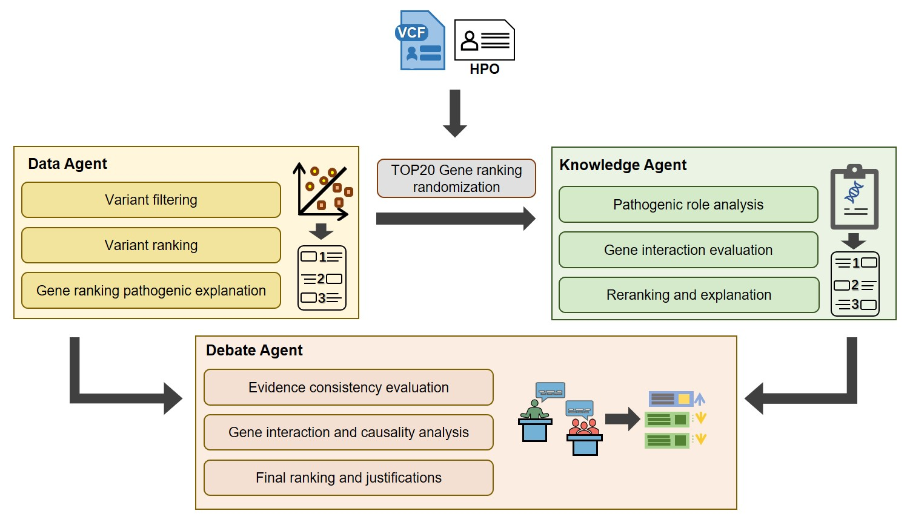
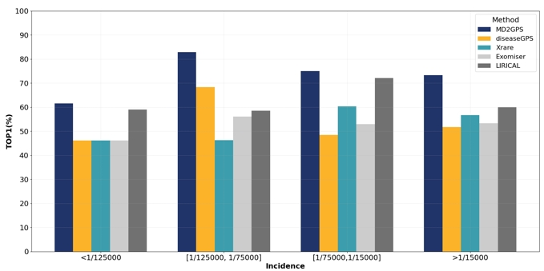

# MD2GPS
**MD2GPS: An LLM-Driven Multi-Agent Debate System for Mendelian**<br>

It is freely available for academic use. However, users should consider the licensing of the databases (annovar, clinvar, and OMIM ).

Introduction
------------
  Accurate diagnosis of Mendelian diseases is crucial for precision therapy and assistance in preimplantation genetic diagnosis. However, existing methods often fall short of clinical standards or depend on extensive datasets to build pretrained machine learning models. To address this, we introduce an innovative LLM-Driven multi-agent debate system (MD2GPS) with natural language explanations of the diagnostic results. It utilizes a language model to transform results from data-driven and knowledge-driven agents into natural language, then fostering a debate between these two specialized agents.<br>
  
  This system has been tested on 1,185 samples across four independent datasets, enhancing the TOP1 accuracy from 42.9% to 66% on average. Additionally, in a challenging cohort of 72 cases, MD2GPS identified potential pathogenic genes in 12 patients, reducing the diagnostic time by 90%. The methods within each module of this multi-agent debate system are also replaceable, facilitating its adaptation for diagnosing and researching other complex diseases.<br>

<br>

<br>


Usage
------------
**Diagnosis of genetic disease**<br>
```bash
bash ${absolute_path}/MD2GPS_workflow.sh \
    $in_vcf \
    $in_hpo \
    $analysis_work_path \
    $out_file_with_path \
    $NUM_THREADS \
    $OPENAI_API_KEY
```

in_vcf: the input vcf file with the genetic variants of the sample. <br>
in_hpo: the input file with the observed HPO IDs in one column. <br>
analysis_work_path: the analysis folder with the absolute path. <br>
out_file_with_path: the output file with the diagnosis results with the absolute path. <br>
NUM_THREADS: cpu cores, we suggest use not less than 20 cores. <br>
OPENAI_API_KEY: the api key of the GPT-4

Dockers
------------
There are 4 docker images were provided. Users should download the docker images and put it in the 'Docker_image' folder: <br>
* ubuntu1604_py3_VCF.sif
* ubuntu2004_Rank.sif
* ubuntu2004_MT.sif
* ubuntu2004_MD2GPS.sif

