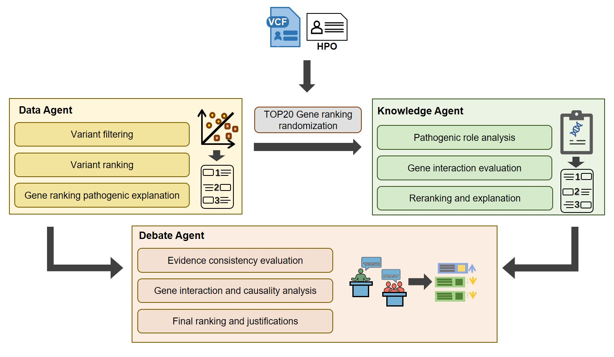
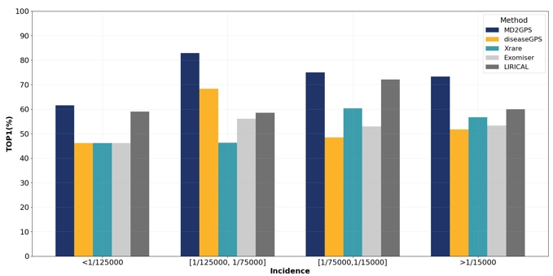

# MD2GPS
**MD2GPS: An LLM-Driven Multi-Agent Debate System for Mendelian**<br>

It is freely available for academic use. However, users should consider the licensing of the databases (annovar, clinvar, and OMIM ).

Introduction
------------
  Accurate diagnosis of Mendelian diseases is crucial for precision therapy and assistance in preimplantation genetic diagnosis. However, existing methods often fall short of clinical standards or depend on extensive datasets to build pretrained machine learning models. To address this, we introduce an innovative LLM-Driven multi-agent debate system (MD2GPS) with natural language explanations of the diagnostic results. It utilizes a language model to transform results from data-driven and knowledge-driven agents into natural language, then fostering a debate between these two specialized agents.<br>
  
  This system has been tested on 1,185 samples across four independent datasets, enhancing the TOP1 accuracy from 42.9% to 66% on average. Additionally, in a challenging cohort of 72 cases, MD2GPS identified potential pathogenic genes in 12 patients, reducing the diagnostic time by 90%. The methods within each module of this multi-agent debate system are also replaceable, facilitating its adaptation for diagnosing and researching other complex diseases.<br>

<br>

<br>


Usage
------------
**Web Version**<br>
Users could use the web version on the https://bmap.sjtu.edu.cn/customanalysis/analysisdatas/107/1<br>
**Upload two files**<br>
1) VCF file: WGS sequencing data of the patient (eg. sample.vcf). <br>
2) Txt file contains HPO IDs in one column, each row containing 1 HPO ID (eg. sample_hpo_id.txt). <br>
3) compressed the two files with the zip or rar format without subfolder. <br>
**Time Consumption**<br>
About 30 minutes for each sample by using 20 cpu cores in webserver <br>

**Locally Version**<br>
**Requires:**<br>
Dockers
------------
There are 4 docker images were provided. Users should download the docker images and put it in the 'Docker_image' folder: <br>
* ubuntu1604_py3_VCF.sif<br>
* ubuntu2004_Rank.sif<br>
* ubuntu2004_MT.sif<br>
* ubuntu2004_MD2GPS.sif<br>

Database used for MD2GPS
------------
The database can be download from our BMAP data repository: https://bmap.sjtu.edu.cn/datastorage/main/63 <br>
The file 'HGMD_Pro_2024.1_hg19.vcf' should be download from HMGD website and put it in the folder 'M2GPS/Database/'. <br>
The file 'hg19.fa' should be download from UCSC genome browser website and put it in the folder 'M2GPS/Database/refseq/'. <br>

**Command line Usage **<br>
```bash
bash ${absolute_path}/MD2GPS_Main.sh \
    Project_Config.json \
    MD2GPS_diagnosis_result.txt \
    /Docker_image/ubuntu1604_py3_VCF.sif
```

Project_Config.json: the json file contains the parameters should be provided by the user. <br>
MD2GPS_diagnosis_result.txt: the analysis result file contains the diagnosis result and explanations. <br>
ubuntu1604_py3_VCF.sif: the docker image file download from BMAP SRS repository(https://bmap.sjtu.edu.cn/softstorage/details/54). <br>